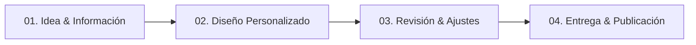

# 🚀 OFERTA DE SERVICIOS WEB & PROPUESTA COMERCIAL
**Arturo Reyes Germán — Desarrollador Web & Software Engineer**  
📍 *Lerma, Toluca, Metepec y proyectos remotos*  
📞 **WhatsApp:** [722 449 5978](https://wa.me/527224495978?text=Hola%20Arturo,%20quiero%20cotizar%20un%20proyecto.)  
💼 **Especialidad:** Páginas Web de Alta Conversión, Catálogos Digitales y Sistemas Web a Medida.

---

## 📌 1. RESUMEN DE LA PROPUESTA DE VALOR

Arturo Reyes ofrece servicios de **diseño y desarrollo web profesional** enfocado en negocios, profesionales independientes y empresas que necesitan vender más, proyectar una imagen profesional y captar clientes directamente a WhatsApp.

### **Diferenciadores Clave:**
* **Velocidad y Rendimiento:** Páginas ultrarrápidas y optimizadas para celulares y computadoras.
* **Diseño Suizo / Editorial Moderno:** Estética limpia, elegante, con efectos 3D, modo oscuro/claro y alta experiencia de usuario (UX/UI).
* **Enfoque Directo a Ventas:** Botones flotantes de WhatsApp, llamadas a la acción (CTA) estratégicas y mapas interactivos.
* **Transparencia y Claridad:** Proceso sencillo en 4 pasos, entrega en plazos breves (3 a 5 días para landing pages) y total independencia para el cliente.

---

## 💼 2. MODELO DE TRABAJO & ALCANCE TÉCNICO

* **Enfoque Principal:** Diseño y Desarrollo Web (Frontend y Backend).
* **Propiedad del Cliente:** El diseño, código e interfaz son propiedad del cliente.
* **Dominio y Hosting:** 
  * El desarrollo **no impone ni incluye pagos recurrentes obligatorios** de dominio/hosting dentro de la tarifa de diseño.
  * Si el cliente desea publicar su página en internet, se le brinda **asesoría y recomendación gratuita** sobre la mejor opción de hospedaje web y dominio.
  * Arturo se encarga de subir e instalar la página en el servidor del cliente si este lo solicita.

---

## 📦 3. PAQUETES & SERVICIOS OFRECIDOS

### 🟢 **PLAN 01: Landing Page de Alta Conversión**
> *Ideal para negocios, consultorios, mecánicos, fondas, servicios a domicilio y profesionales.*

* **Estructura:** Página de 1 sección fluida (Single Page) optimizada para conversión rápida.
* **Características Incluidas:**
  * Diseño 100% adaptable a celulares, tablets y computadoras (Responsive).
  * Botón flotante de WhatsApp con mensaje predefinido para atención directa.
  * Mapa interactivo de ubicación y horarios de atención.
  * Galería de servicios / productos destacados.
  * Formulario de contacto directo.
  * Asesoría opcional para contratación de hosting y subida a internet.
* **Tiempo de Entrega:** 3 a 5 días hábiles.

---

### 🟠 **PLAN 02: Sitio Web Catálogo / Menú Digital**
> *Ideal para restaurantes, cafeterías, tiendas locales, boutiques y negocios con oferta amplia.*

* **Estructura:** Sitio multi-sección o menú digital interactivo.
* **Características Incluidas:**
  * Hasta 5 secciones principales (Inicio, Menú/Catálogo, Nosotros, Galería, Contacto).
  * Catálogo estructurado de productos/servicios con fotografías e información detallada.
  * Botones de pedido o cotización directa a WhatsApp por producto.
  * Generación de **Código QR personalizado** para mesas, lonas o tarjetas de presentación.
  * Asesoría opcional para elección e instalación en servidor.
* **Tiempo de Entrega:** 5 a 8 días hábiles.

---

### 🔵 **PLAN 03: Sistema Web Pro / Automatización a Medida**
> *Ideal para clínicas, refaccionarias, talleres, empresas de logística y operaciones complejas.*

* **Estructura:** Aplicación Web o Plataforma personalizada con lógica de negocio.
* **Características Incluidas:**
  * Cotizadores automáticos en línea.
  * Formulario de citas o reservaciones inteligentes.
  * Integración con bases de datos (MySQL/MariaDB) y APIs REST.
  * Panel de administración privado (Dashboard) para gestión de clientes o inventario.
  * Desarrollado con tecnologías robustas (Laravel, PHP, Livewire, Tailwind CSS).
  * Asesoría, despliegue y capacitación de uso incluida.

---

## 🛠️ 4. TECNOLOGÍA & INFRAESTRUCTURA (STACK)

| Área | Tecnologías Utilizadas |
| :--- | :--- |
| **Frontend** | HTML5, Tailwind CSS, JavaScript (ES6+), GSAP Animation, Lenis Smooth Scroll, Lucide Icons |
| **Backend & Lógica** | PHP, Laravel, Livewire, C# |
| **Bases de Datos** | MySQL, MariaDB |
| **Herramientas & Despliegue** | Git, GitHub, WAMP/LAMP, Docker, SSL (HTTPS) |

---

## 🔄 5. PROCESO DE TRABAJO EN 4 PASOS

1. **01. Idea & Información:** Recopilación de logo, fotos, información del negocio y servicios.
2. **02. Diseño Personalizado:** Creación de la estructura visual moderna enfocada en captar clientes.
3. **03. Revisión & Ajustes:** Presentación del proyecto al cliente para retoques y aprobación final.
4. **04. Entrega de Proyecto:** Entrega de archivos web finales + apoyo y asesoría opcional para subir la página al hosting del cliente.

---

## 📊 6. RECOMENDACIONES PARA MARKETING Y VENTAS

* **Pitch Comercial Recomendado:**  
  *"No solo te vendo una página bonita; te diseño una herramienta de ventas que lleva clientes directo a tu WhatsApp mientras mantienes el control total de tu negocio sin rentas forzosas."*

* **Público Objetivo Principal:**
  1. Negocios en Lerma, Toluca y Metepec (Restaurantes, Talleres, Consultorios, Barberías).
  2. Profesionales independientes (Arquitectos, Contadores, Abogados, Médicos).
  3. Empresas emergentes que requieren sistemas a medida (Cotizadores, Control de Citas).

---

## ⚡ 7. GUÍA TÉCNICA PARA ALCANZAR 100/100 EN LIGHTHOUSE

Para asegurar que cualquier sitio web desarrollado (incluyendo esta landing page) logre **100 puntos en las 4 categorías de Google Lighthouse** (Performance, Accessibility, Best Practices y SEO), el documento consolida los siguientes estándares técnicos indispensables:

### **1. Performance (Rendimiento 100/100):**
* **Imágenes de Nueva Generación:** Usar formatos WebP / AVIF con compresión optimizada y siempre definir atributos `width` y `height` explícitos para evitar desplazamientos de diseño (CLS).
* **Lazy Loading:** Aplicar `loading="lazy"` en imágenes debajo del primer pantallazo (below-the-fold) e iframe de mapas.
* **Preconexión de Fuentes externas:** Preconectar a Google Fonts con `<link rel="preconnect" href="https://fonts.googleapis.com">`.
* **Carga de Scripts No Bloqueantes:** Usar atributos `defer` o `async` en scripts de terceros (Lucide, GSAP, Lenis).
* **Minificación de Assets:** Reducir CSS y JS en entornos de producción.

### **2. Accessibility (Accesibilidad 100/100):**
* **Contraste de Color:** Asegurar una relación de contraste mínima de `4.5:1` para texto normal (validado con el fondo obsidian `#070709` y el naranja `#ff5500`).
* **Atributos ALT:** Todas las imágenes o SVGs decorativos cuentan con `alt=""` o `aria-hidden="true"`.
* **Etiquetas ARIA:** Todos los botones interactivos (como el menú hamburguesa o el switch de tema) llevan `aria-label="Nombre descriptivo"`.
* **Navegación por Teclado:** Asegurar que los elementos enfocables (`<a|button>`) muestren un contorno visual claro `focus-visible`.

### **3. Best Practices (Buenas Prácticas 100/100):**
* **HTTPS y Seguridad:** Servir bajo candado SSL con certificados HTTPS activos.
* **Vulnerability-Free Dependencies:** Utilizar librerías en versiones estables y actualizadas.
* **Console Cleanliness:** Evitar errores JavaScript o advertencias no controladas en la consola del navegador.

### **4. SEO (Optimización para Motores de Búsqueda 100/100):**
* **Meta Etiquetas Básicas:**  
  * `<title>` descriptivo único de menos de 60 caracteres.
  * `<meta name="description">` atractiva de entre 120 y 155 caracteres.
  * `<meta name="viewport" content="width=device-width, initial-scale=1.0">`.
  * `<link rel="canonical" href="...">`.
* **Estructura Jerárquica H1-H6:** Exactamente un solo tag `<h1>` por página, seguido de jerarquía ordenada `<h2>`, `<h3>`.
* **Datos Estructurados (Schema.org / JSON-LD):** Marcado semántico de *LocalBusiness* o *ProfessionalService* para que Google muestre la empresa enriquecida en búsquedas locales.

---

## 🔍 8. ESTRATEGIA DE PALABRAS CLAVE (SEO LOCAL & BÚSQUEDA ORGÁNICA)

Para que los clientes encuentren la página web en Google de forma orgánica, la estructura y contenido deben responder a las siguientes **búsquedas con alta intención de compra**:

| Tipo de Búsqueda | Palabras Clave de Alto Valor (Keywords) |
| :--- | :--- |
| **Búsqueda Local Directa** | *Desarrollador web en Lerma*, *Creación de páginas web Toluca*, *Diseño web Metepec*, *Páginas web económicas Lerma* |
| **Búsqueda por Necesidad** | *Página web para restaurante*, *Cotizar página web para negocio*, *Crear menú digital QR*, *Landing page para WhatsApp* |
| **Búsqueda por Especialidad** | *Programador Laravel México*, *Desarrollador Full Stack PHP*, *Crear sistema de citas web*, *Desarrollo de cotizador en línea* |

---
*Documento actualizado con la Guía de Optimización Lighthouse 100 & Estrategia SEO.*
